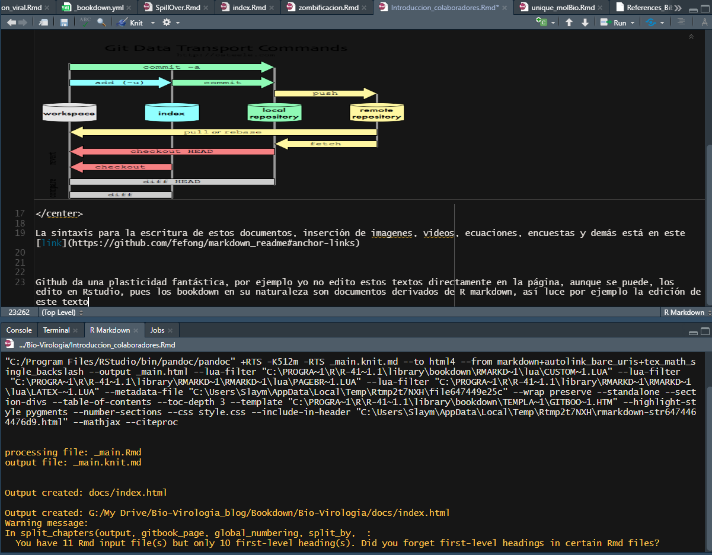

## Bienvenidos a BIO-VIROLOGÍA {-}

Los virus son mucho más que **"una mala noticia envuelta en una cubierta de proteína".**

[Click acá para ir al libro de Bio-Virología](https://aimergdiaz.github.io/Bio-Virologia/)

Todo lo que vez acá es tras bambalias, así que, si quieres lanzar un libro similar, escríbeme a aimerdiaz.evo@gmail.com , [o comenta acá](https://github.com/AimerGDiaz/Bio-Virologia/discussions/10) o en el post del lanzamiento del libro en [Facebook](https://www.facebook.com/BioViral/posts/257203693073614), donde quieras. 

Para lanzar mi Bookdown seguí estas guías: 

1. [Escritura de libros con `bookdown`](https://rubenfcasal.github.io/post/intro-bookdown/ )
2. [Host your book on GitHub for free via GitHub Pages](https://bookdown.org/yihui/bookdown/github.html)

## Lectores {-}

## Colaboradores {-}

Hola Colaboradores,

Victor y Roberto, bienvenidos a esta nueva etapa del proyecto. Github nos permite trabajar de manera sincronizada pero con un sistema de control de cambios del que pueden familiarizarse acá

<https://stackoverflow.com/questions/2745076/what-are-the-differences-between-git-commit-and-git-push>

Por cierto los roles por ahora son Victor -escritor / editor- y Roberto -diseñador / escritor (aún no confirmado, recuerda que Victor, Natalia o yo podemos editar tus textos)- , así que para familiarizar a Roberto con la introducción de contenido gráfico, pondré la imagen del link anterior:

{width="80%"} 

La sintaxis para la escritura de estos documentos, inserción de imagenes, videos, ecuaciones, encuestas y demás está en este [link](https://github.com/fefong/markdown_readme#anchor-links)

Github da una plasticidad fantástica, por ejemplo yo no edito estos textos directamente en la página, aunque se puede, los edito en Rstudio, pues los bookdown en su naturaleza son documentos derivados de R markdown, así luce por ejemplo la edición de este texto:

{width="80%"} 

Así que este texto será el primero para editar y comprender la dinámica de github.

Una vez más bienvenidos.