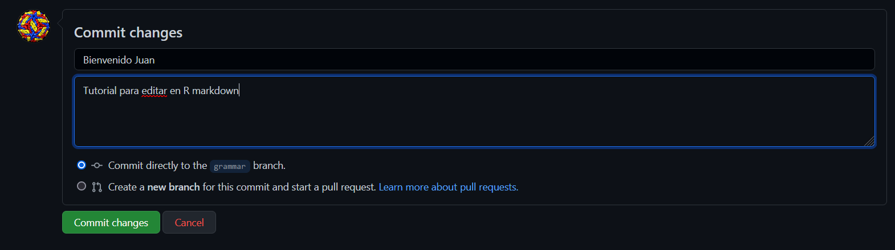

## Bienvenidos a BIO-VIROLOGÍA 

Los virus son mucho más que **"una mala noticia envuelta en una cubierta de proteína".**

[Click acá para ir al libro de Bio-Virología](https://aimergdiaz.github.io/Bio-Virologia/)

Todo lo que vez acá es tras bambalias, así que, si quieres lanzar un libro similar, escríbeme a aimerdiaz.evo@gmail.com , [o comenta acá](https://github.com/AimerGDiaz/Bio-Virologia/discussions/10) o en el post del lanzamiento del libro en [Facebook](https://www.facebook.com/BioViral/posts/257203693073614), donde quieras. 

Para lanzar mi Bookdown seguí estas guías: 

1. [Escritura de libros con `bookdown`](https://rubenfcasal.github.io/post/intro-bookdown/ )
2. [Host your book on GitHub for free via GitHub Pages](https://bookdown.org/yihui/bookdown/github.html)

## Lectores 

## Colaboradores 

Hola Colaboradores,

Victor, Juan y Roberto, bienvenidos a esta nueva etapa del proyecto. Github nos permite trabajar de manera sincronizada pero con un sistema de control de cambios del que para antes de hacer cualquier cambio, deben familiarizarse [acá](https://stackoverflow.com/questions/2745076/what-are-the-differences-between-git-commit-and-git-push). 

En concreto es importante antes de editar saber que es `commit`, `push` y `pull`, pues github es un ambiente de coolaboración cuya sincronización esta controlada por cambios de versiones. En resumidas cuentas, se debe saber desde que branch o rama se hacen las ediciones, lo ideal es que no sea main, sino grammar, esto se observa una vez al dar click al lápiz del margen superior derecho: 

En efecto me encuentro editando este mismo documento en la rama grammar. Una vez termino la edición, para guardar los cambios debo especificar en el recuadro inferior 

Dan click en `commit changes`. Puede que los cambios se noten en el documento, pero aún no están sincronizados en común, este paso lo debo hacer yo. Para evaluar la compresión de los requisitos mínimos para editar, la tarea es corregir la siguiente frase:

Yo, Juan Corao, esoy empezando a entender cómo se edita y se hacen cambios en github.

La sintaxis para la escritura de estos documentos, inserción de imagenes, videos, ecuaciones, encuestas y demás está en este [link](https://github.com/fefong/markdown_readme#anchor-links)

Github da una plasticidad fantástica, por ejemplo yo no edito estos textos directamente en la página, aunque se puede, los edito en Rstudio, pues los bookdown en su naturaleza son documentos derivados de R markdown, así luce por ejemplo la edición de este texto:

<!--{width="80%"} -->

Así que este texto será el primero para editar y comprender la dinámica de github.

Una vez más bienvenidos.
