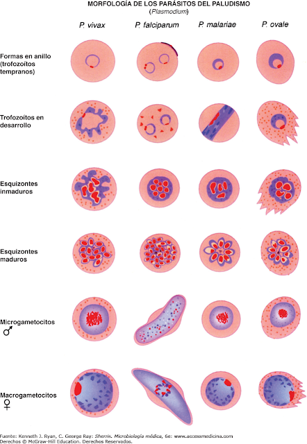

# Domesticación viral: {#domestic}

**El kit de herramientas del biólogo molecular**

¿Qué sería de la biología molecular si los virus no existiesen?. ¿Aún estaríamos debatiendo sobre el agente transformador de Griffith si no existiesen bacteriófagos?. ¿Tendríamos anticuerpos monoclonales si el premio nobel argentino César Milstein no hubiese dispuesto del virus de la rubéola capaces de inducir [hibridomas](http://www.quimicaviva.qb.fcen.uba.ar/contratapa/aprendiendo/capitulo10.htm), sin la actividad viral de inducir fusión celular?. ¿Cómo manipularíamos el comportamiento molecular de los organismos o líneas celulares genéticamente modificadas sin el promotor de expresión constitutiva del virus del mosaico del coliflor:CaMV 35S?

Estas y otras preguntas serán abordadas en este capítulo, en donde recopilaremos el desarrollo de las técnicas de biología molecular desde la perspectiva virológica. Pero, dada la plasticidad del formato en el que estamos escribiendo la presente obra, empezaremos por el final, con la la pregunta que titula la primera sección del presente capítulo:

**¿Qué papel desempeña el virus de la hepatitis B en la vacuna contra la malaria "RTS,S"?**

Por más de 100 años de búsqueda, ninguna vacuna había superado la barrera de efectividad mínima requerida por la Organización Mundial de la Salud para enfrentar una de las enfermedades tropicales más severas: la malaria o el paludismo. A diferencia de múltiples patógenos bacterianos o virales en los que el hallazgo de una vacuna ha requerido un menor tiempo de investigación, para el desarrollo de métodos de inmunización preventiva contra *Plasmodium falciparum*, el agente causal de la enfermedad, que al ser un organismo eucarionte multicelular, es por ende capaz de reproducirse sexualmente,y de manera similar a como acontece en virus con este tipo de reproducción, por ejemplo el virus de la influenza, la variabilidad genética derivada de la recombinación sexual le permite al patógeno burlar en términos de pocas generaciones el sistema inmunológico del huésped. Adicional a la estrategia reproductiva, támpoco la estrategia de vacunación recurrente es capaz de apaciguar a *P. falciparum*, pues adicional a la variabilidad antigénica, la complejidad de su ciclo de vida de este parásito le permite revestirse cada etapa del ciclo de vida con morfologías diferentes, tanto a nivel celular como molecular, gráficamente: 

{ width=60% }

Así que, en el diseño de vacunas clásicas, escoger qué proteína o cuantas proteínas diferentes capaces de reducir la propagación del patógeno pese a su variabilidad por recombinación genética fue una de las principales limitantes a la hora de desarrollar vacunas efectivas. De hecho la reconocida pero fallida estrategia del inmunólogo colombiano Manuel Elkin Patarroyo, la vacuna "SPf66" empleaba múltiples proteínas sintéticas de los estadios eritrocitarios del patógeno, estado en el que circula en la sangre de su huésped, aunque pionera en su tiempo, el mejor valor de efectividad alcanzado llegó a ser de un reducido 28% (@graves2006vaccines).  

[Ciclo de vida de *Plasmodium falciparum*{ width=70% }

De allí que la fecha del 6 de Octubre del 2021 pasará a los análes de la investigación biomédica, pues es este el día en que la Organización Mundial de la Salud  
