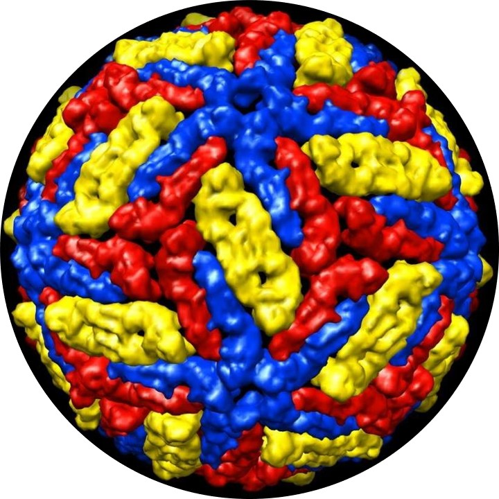

--- 
title: 'BioVirología: La biología de los virus'
author: "Aimer G. Diaz"
date: "©2021"
output:
  html_document:
    df_print: paged
  pdf_document: default
documentclass: book
bibliography:
- book.bib
- packages.bib
- References_Bibtex.bib
biblio-style: apalike
global_numbering: yes
description: |
  BioVirología es el primer libro electrónico e interactivo de virología biológica o biovirología, y el primero de divulgación científica en español empleado el formato de libros Bookdown.
link-citations: yes
lang: es
github-repo: AimerGDiaz/Bio-Virologia
site: bookdown::bookdown_site
---
<!-- Launch the bookdown to bookdown website 
follow 
https://bookdown.org/home/about/ 

Publish as a website 
https://rpubs.com/colleengerrity/bookdown-website-tutorial

Add a nicer beginning 
https://stackoverflow.com/questions/57075704/insert-multiple-pages-before-body-with-bookdown 
file.create('git/.nojekyll')
-->
# Bienvenidos al bookdown de BioVirología {-}

El Blog en Facebook [Biovirología](https://www.facebook.com/BioViral/) ha sido re-lanzado bajo el formato  nada tradicional de libros electrónicos: Bookdown, un formato web de los libros electrónicos. Este permite escribir, editar y hasta interactuar con los lectores, además de insertar códigos escritos en los lenguajes de programación R, bash y python, como también el output de estos códigos. Así, con esta transición BioVirología se convierte en el primer blog de divulgación científica en español en hacerse libro electrónico interactivo, además del primero de virología biológica o biovirología. 

El proyecto de Biovirología inició en un nada remoto [19 de mayo del 2020](https://www.facebook.com/permalink.php?story_fbid=107125457678944&id=107088044349352), con el siguiente post reproducido a continuación: 

Inauguro este espacio de divulgación científica en español sobre artículos de investigación en virología desde una perspectiva netamente biológica. En este espacio los virus no solo serán agentes etiológicos o factores causales de enfermedades en humanos; en vez de esto se discutirán como los virus que fungen como nanobiota, son componentes esenciales de nuestra microbiota. 
Sobra decirlo, a la pregunta si los virus ¿ viven o no ?. La respuesta es un contundente Si, en palabras del virólogo Frances Patrick Forterre: 

"(Los) virus no deben confundirse con sus viriones, sino que se pueden ver como entidades vivientes complejas que transforman la célula infectada en un organismo nuevo, el virus, que produce viriones."

"Viruses are no more confused with their virions, but can be viewed as complex living entities that transform the infected cell into a novel organism—the virus—producing virions" @forterre2010defining 

Por la anterior cita, las historias que se contarán serán sobre las fábricas virales (viriones replicantes o una vez germinados en células) y no a las semillas proteicas (viriones) a las que llamaremos virucélulas (virocells). @mukhopadhyay2003structure
 

{width="80%"}

A manera introductoria de las maravillas del formato empleado los invito a ver el siguiente video que permite introducir a uno de los autores del presente documento: 
<!---{width="80%"} --->

## Interacción {-}

¿Deseas comentar, corregir, sugerir, opinar o preguntar algo sobre el <Bookdown>? Puedes hacerlo [en esta sección](https://github.com/AimerGDiaz/Bio-Virologia/discussions/10). 

## Licencia {-}

Este obra está protegida bajo una licencia de [Creative Commons Reconocimiento-NoComercial-SinObraDerivada 4.0 Internacional](https://creativecommons.org/licenses/by-nc-nd/4.0/deed.es_ES)

